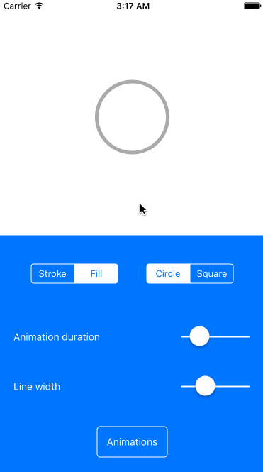

# React Native BEMCheckbox
React Native bridge for awesome [BEMCheckBox](https://github.com/Boris-Em/BEMCheckBox)

**iOS Only**



### Content
- [Installation](#installation)
- [Usage example](#usage-example)
  - [Basic usage](#basic-usage)
- [Component properties](#component-properties)
- [Changelog](#changelog)
- [License](#license)

### Installation
1. Install package via `npm`:

  ```sh
  npm install --save react-native-bem-check-box
  ```

2. Link your library by one of those ways: either by using `rnpm link` (see more about rnpm [here](https://github.com/rnpm/rnpm)) or like it's [described here](http://facebook.github.io/react-native/docs/linking-libraries-ios.html).
3. Inside your code include JS part by adding

  ```javascript
  import BEMCheckBox from 'react-native-bem-check-box';
  ```

5. Compile and have fun!

### Usage example
You can run built-in example via few simple steps:

1. Clone repository
2. Go to `Example`
3. Run `npm install && open CheckBox.xcodeproj`
4. Hit "Run"(`cmd+R`) button on XCode panel

#### Basic usage

```javascript
import BEMCheckBox from 'react-native-bem-check-box';

<BEMCheckBox
  onValueChange={value => this.setState(value)}
/>
```

### Component properties

Check [this section](https://github.com/Boris-Em/BEMCheckBox#customization) in `BEMCheckBox` document

- `value` (boolean) - The current state. **Defaults to `false`**

- `lineWidth` (number) - The width of the lines of the check mark and box. **Defaults to `2.0`**

- `hideBox` (boolean) - boolean to control if the box should be hidden or not. Setting this property to `true` will basically turn the checkbox into a check mark. **Defaults to false**

- `boxType` (string) - The type of box to use. **Defaults to `circle`**
  - `circle`
  - `square`

- `tintColor` (string) - The color of the line around the box when it is Off. **Defaults to `#aaaaaa`**

- `onCheckColor` (string) - The color of the check mark when it is On. **Defaults to `#007aff`**

- `onFillColor` (string) - The color of the inside of the box when it is On. **Defaults to `transparent`**

- `onTintColor` (string) - The color of the line around the box when it is On. **Defaults to `#007aff`**

- `animationDuration` (number) - The duration in seconds of the animations. **Defaults to `0.5`**

- `onAnimationType`/`offAnimationType` (string) - The type of animation to use when the checkbox gets checked/unchecked. **Defaults to `stroke`**
  - `stroke`
  - `fill`
  - `bounce`
  - `flat`
  - `one-stroke`
  - `fade`

- `onValueChange` (function) - every time the check box gets tapped, after its properties are updated, but before the animations are completed.

- `onAnimationEnd` (function) - every time the check box finishes being animated.

## Changelog

- 0.3.2 Animate on `value` property set
- 0.3.1 Updated podspec
- 0.2.0 Added Example
- 0.1.0 Initial release

## License

Copyright 2016 Rifat Nabi  
Licensed under the MIT License.
